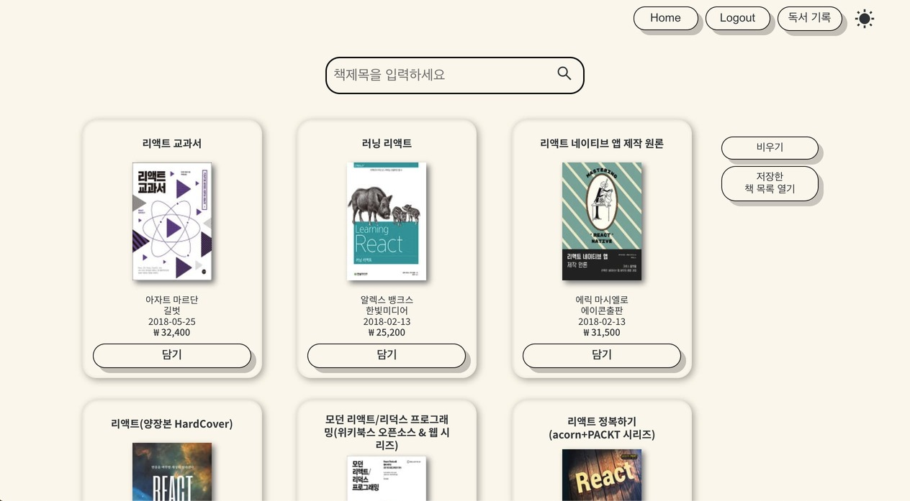
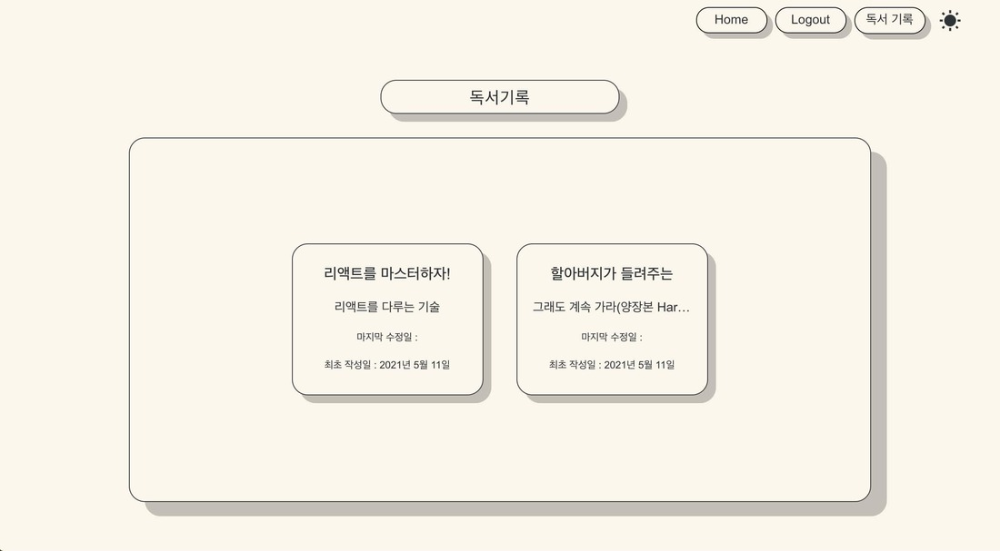
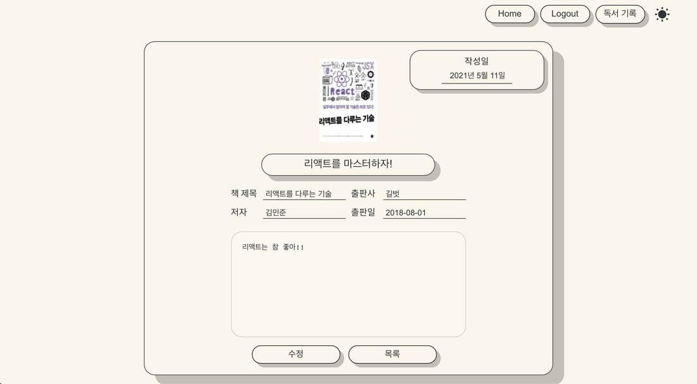
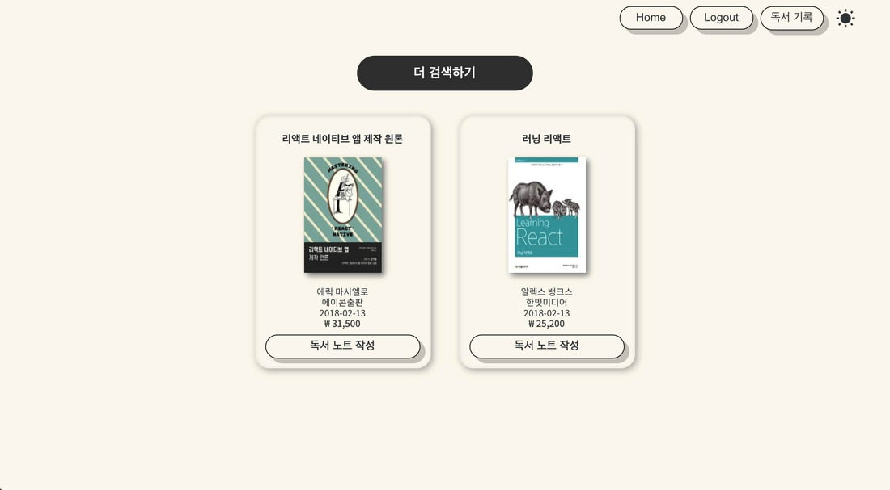

# :closed_book: Bookmemo

## Table of contents

- [Technologies](#technologies)
- [What is Bookmemo](#what-is-bookmemo)
- [Installation](#installation)

## Technologies

- REACT
- redux, redux-thunk
- react-router-dom
- Rest API(Kakao API)
- SASS(SCSS)

Test account -> id: test, password: 1234

## What is Bookmemo?

Bookmemo aims to make taking notes for books easier.

Using Kakao API when you choose a book and try to take a note about it, the program automatically puts book information(book img, book name, author, publisher, etc.) for you.

책 검색 기능과 함께 책 기록 시 책 정보가 자동으로 입력되는 서비스

- Two theme : Dark mode & Light mode available
- Search books
  <br>
  
  
  <br>
- Create account/ Login Page
  <br>
  
  
  <br>
- Book information is automatically inputted in your note
- Delete and edit notes
  <br>
  
  
  
  
  <br>
- Save the books that you searched
  <br>
  
  
  <br>

## Setup

To run this project, install it locally using npm:

1. Clone the repo

```bash
git clone https://github.com/Globalkmaria/bookmemo.git
```

2. Go into the folder

```bash
cd bookmemo
```

3. Install NPM packages

```bash
npm i
```

4. Start server

```bash
npm start
```
