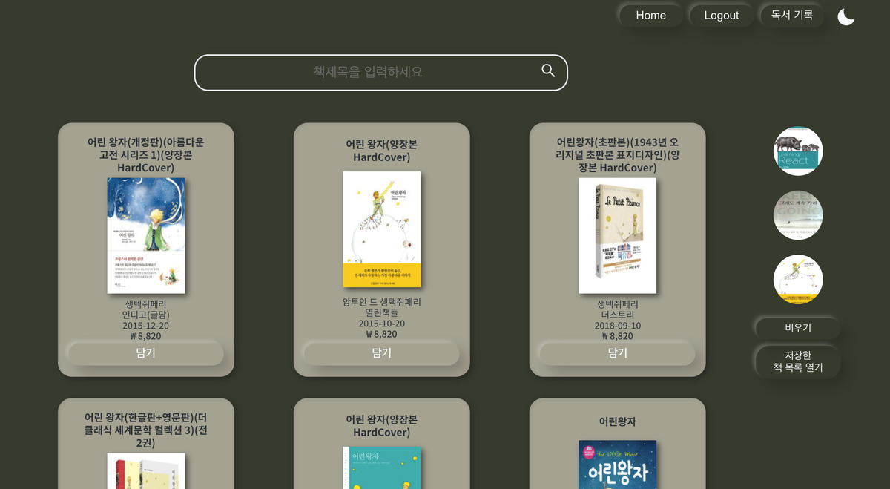
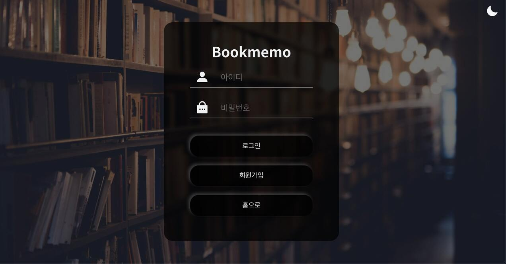
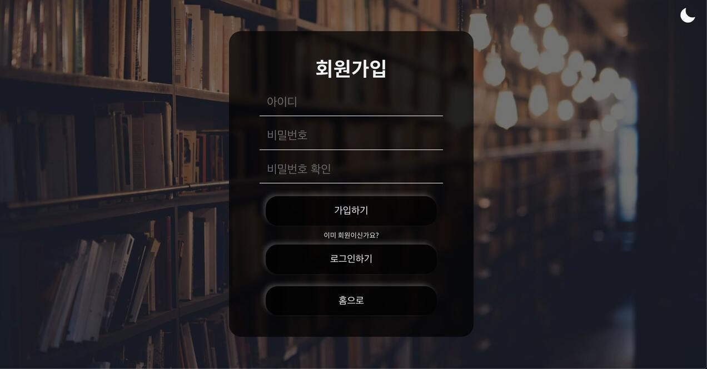
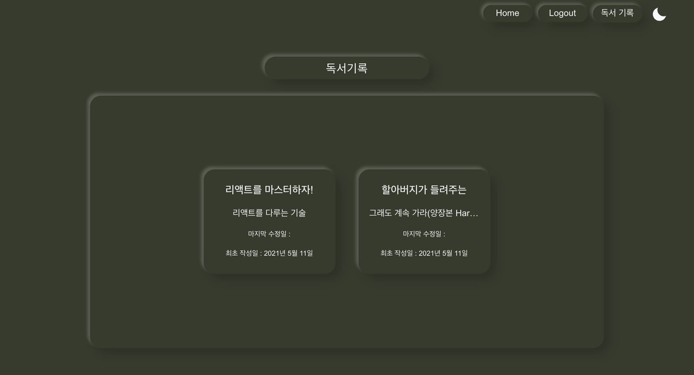

# :closed_book: 카카오 API를 이용한 책 검색 및 책 저장하기 서비스

- REACT, redux, redux-thunk, react-router-dom 사용
- 테스트 계정 -> id: test, password: 1234

<br>

## What is Bookmemo?

### 책 검색 기능과 함께 책 기록 시 책 정보가 자동으로 입력되는 서비스

- 라이트모드/다크모드 제공
- 책 검색 기능
  <br>
  
  
  <br>
- 계정 생성, 로그인을 통한 개인 독서 기록 관리 제공
  <br>
  
  
  <br>
- 책 메모 서비스 이용 시 API를 통한 책 정보 자동 입력
- 독서 기록, 수정, 관리 기능
  <br>
  
  
  
  
  <br>
- 검색한 책 저장 기능
  <br>
  
  
  <br>

## Installation

1. Git 클론 또는 다운받기

```bash
git clone https://github.com/Globalkmaria/bookmemo.git
```

2. 해당 문서 들어가기

```bash
cd bookmemo
```

3. 터미널에서 npm i 라이브러리 전체 설치

```bash
npm i
```

4. 터미널에서 npm start 로 서버 실행

```bash
npm start
```

- Visual Studio Code 에서 작성, 크롬에 최적화 되어있습니다.
